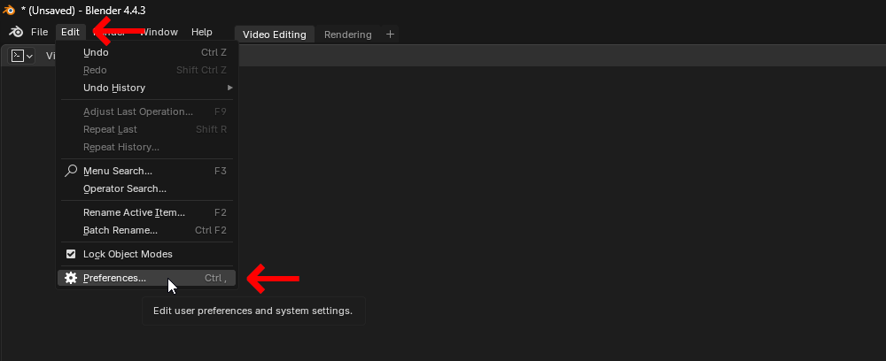
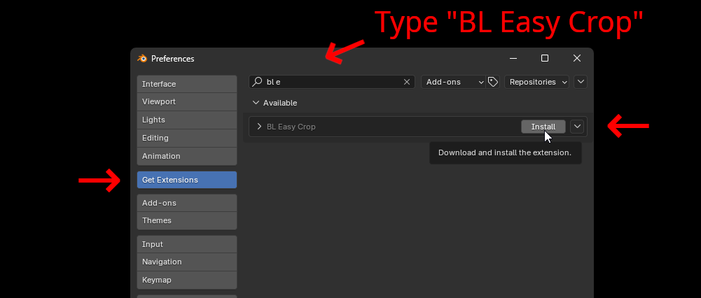
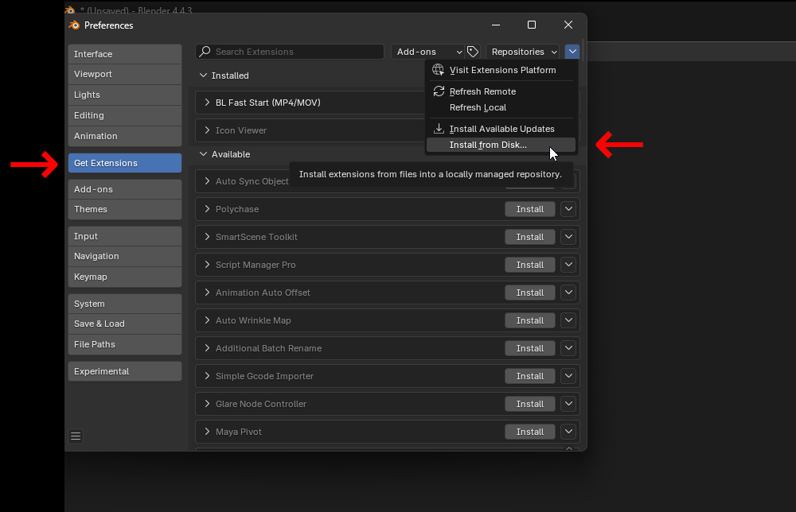
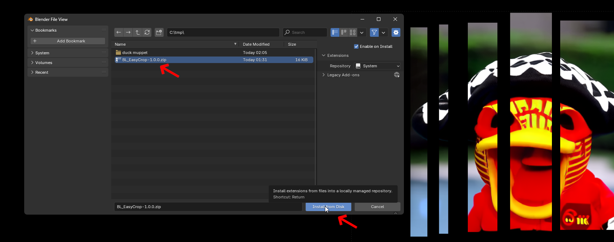

# BL Perspective Transform

BL Perspective Transform lets you click and drag handles to do a perspective transform in Blender's Visual Sequence Editor / preview window.

It can be accessed via the preview window toolbar, menus or keyboard shortcut (default "P").

Also credit to nickberckley for gizmo tips and custom icon assistance https://github.com/nickberckley/bool_tool

 

Quick breakdown of menu options, etc:

 

## Compatibility

- Blender 4.4+
- Works with all strip types that support cropping
- Compatible with transform strips

## Auto Installation

## Manual Installation

Download the latest [zip](https://github.com/usrname0/BL_PerpectiveTransform/releases). Install it as a zip file like this:

   
## Troubleshooting

It should just work right away after installing.  If the addon doesn't appear after installation:
1. Make sure you're using Blender 4.4 or newer
2. Check the console for any error messages
3. Try restarting Blender after installation
