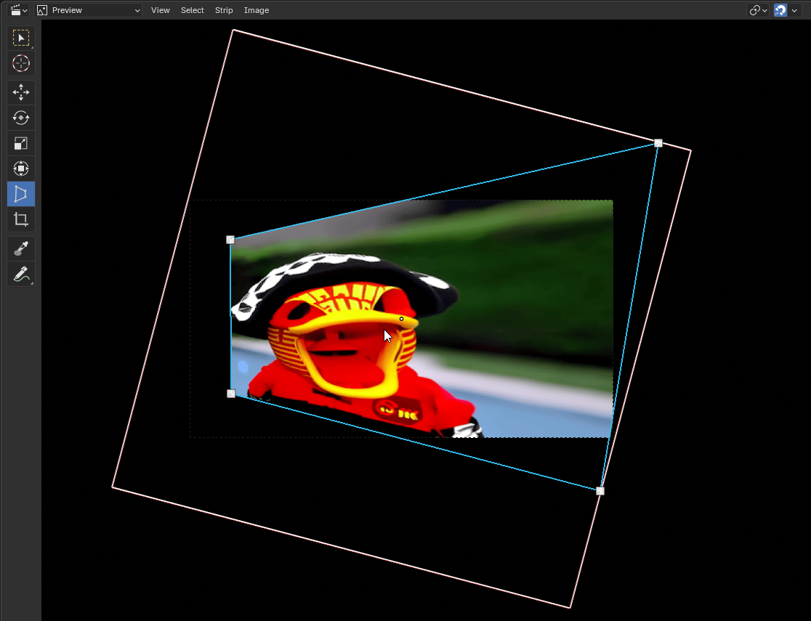
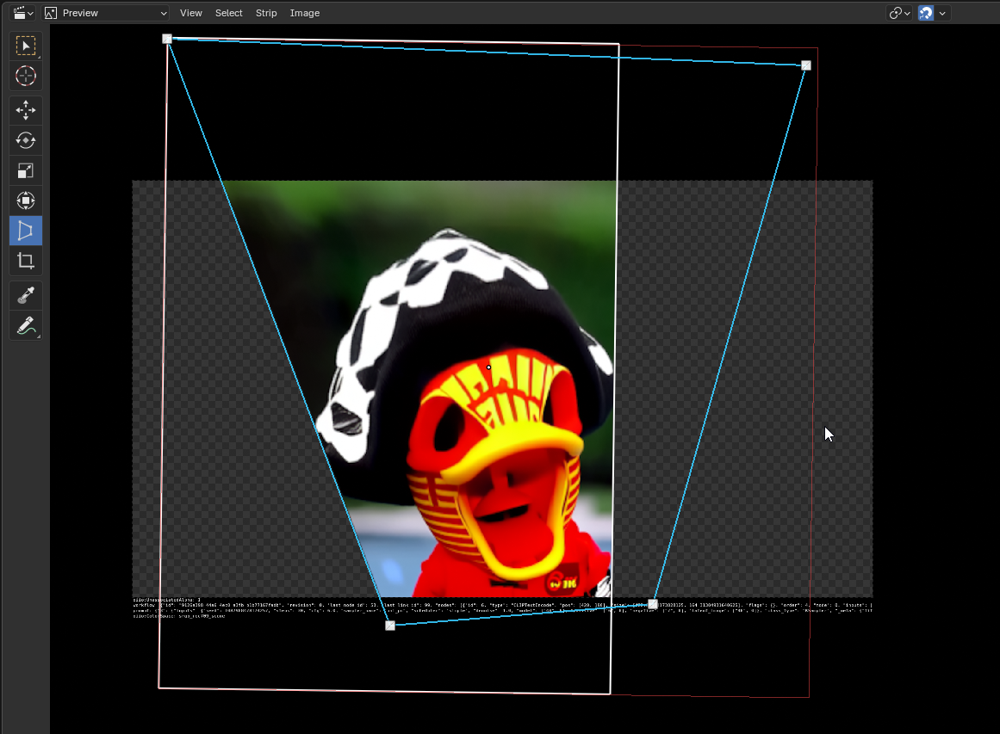
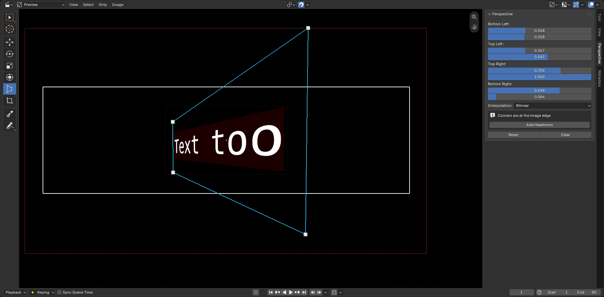

# BL Perspective Transform

Drag the four corners of a strip in Blender's Video Sequence Editor preview to
distort it, and have the distortion render.

Reach it from the preview toolbar, the Transform menus, or the keyboard shortcut
(default "P").

Corners can be dragged anywhere within the strip's geometry, which can
be scaled out of bounds, rotated, cropped, etc. as usual.

A corner will not drag into a shape the perspective cannot be solved for - pull
one past its neighbours and the handle simply stops rather than letting the
strip render blank.

The transform is stored as a Corner Pin node inside a compositor strip modifier,
so Blender evaluates it as part of normal strip rendering. What you see is what
renders.

Because the transform lives in a node group on the strip, it survives save and
load, shows up in the Strip Modifiers tab, and every corner can be keyframed.

## Animating a corner

Corners animate the way the rest of Blender does.

- Turn on **auto-keying** and drag a handle. The corner you dragged is keyed at
  the current frame, so move to another frame, drag it again, and it
  interpolates. Only that corner is keyed - the others are left alone.
- Or key by hand: click the dot beside any value in the Perspective panel.
- The keys appear in the **Dope Sheet** under your scene, in a channel named
  after the strip, and retime like any other animation.

Turning auto-keying on matters. Once a corner is keyframed it is driven by its
curve, so dragging it without auto-keying looks like it worked and then reverts
on the next frame change - the panel says so when that is the situation.

**Reset** clears the corner animation along with the shape. **Add Headroom**
moves every keyframe with it, so an animated transform stays put.

## Compatibility

- **Blender 5.0 or newer.** Compositor strip modifiers, which this depends on,
  were added in 5.0. Tested against 5.0.1, 5.1.2 and 5.2.1 LTS.
- Works with any visual strip: image, movie, text, color, scene, etc.
- Works alongside the strip's own scale, rotation, mirror and crop

## Usage

1. Select a strip and open the VSE preview
2. Activate the Perspective tool from the toolbar, or press "P"
3. Drag any of the four corner handles

Numeric corner values, an interpolation setting and Reset / Clear buttons are in
the **Perspective** panel, in the **Strip** tab of the Properties editor, just
below Crop.

### Dragging corners outward

Blender's Corner Pin node clamps corners to the edges of the source rectangle,
so by default a corner cannot be dragged outside the strip's original bounds.
When you hit that limit the panel offers **Add Headroom**, which enlarges the
strip while holding the image visually still, leaving room to drag into.

The scale transform (and others) may also be used manually to make room for pins.

## Installation

Download the latest [zip](https://github.com/usrname0/BL_PerspectiveTransform/releases)
and install it as an extension: in Blender, Edit > Preferences > Add-ons, then
the drop-down arrow at the top right > Install from Disk, and pick the zip.

## Troubleshooting

It should work immediately after installing. If the tool does not appear:

1. Check you are on Blender 5.0 or newer - on 4.x the addon will not load
2. Check the console for errors
3. Restart Blender
